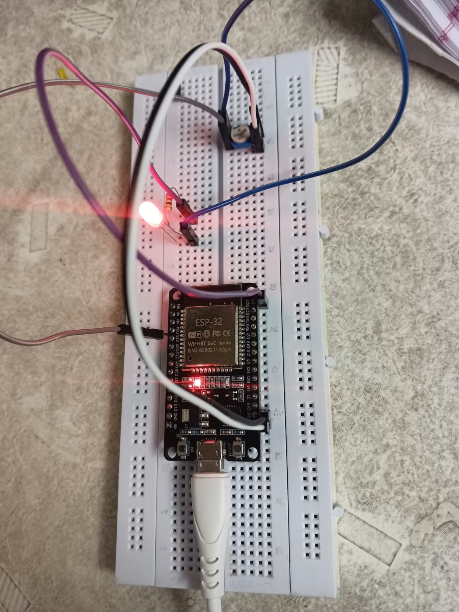
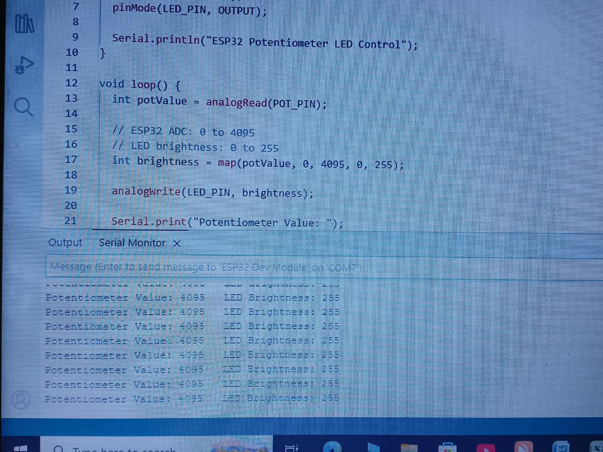

# ESP32 Smart Control Panel

A beginner-friendly ESP32 project that demonstrates analog input, LED brightness control, and Serial Monitor communication.

## 🔧 Components

- ESP32 Dev Module (ESP32-WROOM)
- LED
- 220–330 Ω resistor
- 10 kΩ potentiometer
- Breadboard
- Jumper wires
- USB cable

## 🔌 Pin Connections

| Component | ESP32 Pin |
|---|---|
| LED | GPIO 23 |
| Potentiometer | GPIO 34 |

## ⚙️ How It Works

The potentiometer provides an analog voltage to GPIO 34.

The ESP32 reads the potentiometer using its ADC:

`0 – 4095`

The value is then mapped to:

`0 – 255`

This value controls the LED brightness.

The potentiometer value and LED brightness are also displayed in the Serial Monitor at 115200 baud.

## 💻 Software

- Arduino IDE
- ESP32 Dev Module
- Embedded C/C++

## 🚀 Features

- Analog input using ESP32 ADC
- LED brightness control
- Serial Monitor output
- Real-time potentiometer reading

## 📷 Project

Hardware demonstration and circuit images will be added here.

## 📌 Project Status

**Status: Completed ✅**

Currently working:
- ✅ ESP32 Dev Module
- ✅ Potentiometer analog input
- ✅ LED brightness control
- ✅ Serial Monitor output
- ✅ Real-time potentiometer readings

## ⚙️ How the Project Works

The potentiometer acts as an analog input device.

**Potentiometer → ESP32 ADC → Value Mapping → LED Brightness**

1. The potentiometer produces a variable voltage.
2. The ESP32 reads this voltage through **GPIO 34 (ADC)**.
3. The ESP32 ADC converts the voltage into a digital value from **0 to 4095**.
4. The program maps this value from **0–4095 to 0–255**.
5. The resulting value controls the LED brightness on **GPIO 23**.
6. The potentiometer reading and LED brightness are displayed in the Serial Monitor.

### Signal Flow

`Potentiometer → GPIO 34 (ADC) → ESP32 → GPIO 23 → LED`

Turning the potentiometer changes the ADC value, which changes the LED brightness in real time.
Not implemented yet:
- ⏳ Push-button control
- ⏳ Wi-Fi/web control

## 🔮 Future Improvements

- Add push-button control
- Add multiple LEDs
- Add Wi-Fi control
- Create a web-based control panel

## 👨‍💻 Author

Rajneesh Yadav

## 📷 Project Setup

## 🖥️ Serial Monitor

